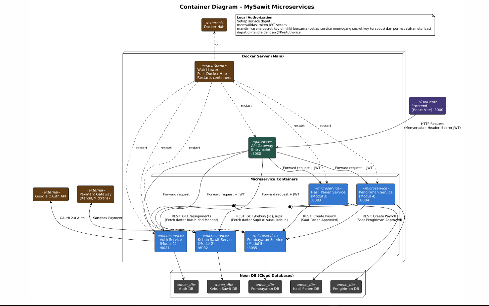
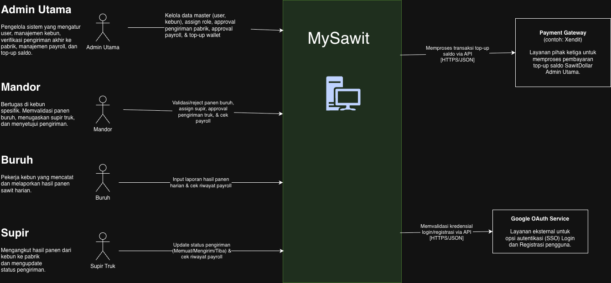
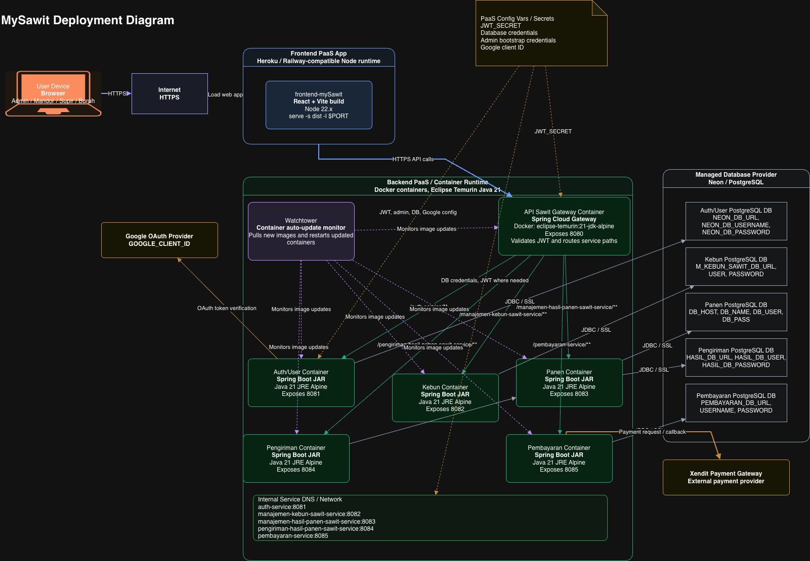
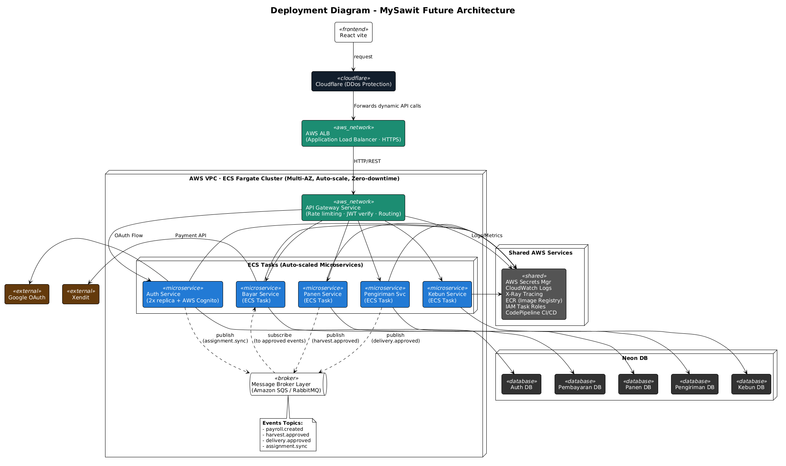

# Diagram

## Container Diagram

## Context Diagram

## Deployment Diagram

## MySawit Future Architecture

Jika sebelumnya, arsitektur MySawit masih memiliki berbagai kerentanan. Alhasil, kami melakukan pengembangan dengan melakukan shifting dari sekadar VPS biasa ke infrastruktur yang lebih cloud-native dan serverless. Mengenai hal itu, kami akan mengimplementasikan deployment dengan AWS ECS Fargate agar deployment tidak hanya terpaku di satu VPS, tetapi sudah “serverless” karena ekosistem penggunaan server sudah disesuaikan oleh AWS sendiri. Hal ini akhirnya dapat membuat sistem bersifat auto-scale dan zero-downtime deployment. 

Lalu, kami juga menambahkan di bagian depan, request dari frontend (React Vite) akan masuk dulu ke Cloudflare untuk mencegah adanya serangan DDoS. Hal ini akan dicegah dengan prinsip-prinsip yang ada diterapkan oleh cloudflare. Setelah itu, jika aman, request akan diteruskan ke Application Load Balancer (ALB) AWS. Penggunaan Application Load Balancer adalah untuk mendistribusikan beban trafik secara merata ke task atau container yang tersedia sehingga mencegah terjadinya overload pada satu titik. Setelah dari ALB, request masuk ke API Gateway yang berfungsi untuk mengurusi spesifik routing, rate limiting, dan verifikasi token JWT sebelum di-forward ke service yang tepat. Setiap service di sini juga sudah auto-scaled karena semua service di-deploy menggunakan AWS ECS Fargate yang sama.

Selain itu, hal krusial lainnya adalah komunikasi antar-service kami rombak total menjadi fully asynchronous dengan implementasi message broker, yakni RabbitMQ. Sebagai contoh, ketika service Panen atau Pengiriman melakukan approval, mereka nggak nge-hit API service Pembayaran secara langsung, tetapi cukup melakukan publish event, seperti harvest.approved, dan service Pembayaran cukup subscribe untuk triggering payroll. Hal ini kami lakukan untuk menghindari blocking dalam komunikasi antarservice sehingga sebuah service tidak perlu membuang waktu menunggu respon dari service lain. Selain itu, untuk kebutuhan pembacaan data lintas domain, misalnya service Kebun butuh data mandor, kami menerapkan replikasi data via RabbitMQ. Alhasil, sebuah service tidak perlu terus-menerus menembak API service utama hanya untuk membaca data, melainkan cukup mengambil dari database lokalnya sendiri yang datanya secara otomatis disinkronkan melalui message broker.

## Risk Analysis Before Future Architecture
# Risk Analysis — MySawit Microservices Architecture 

## Risk Assessment Table

| ID | Risk | Deskripsi | Likelihood (1–5) | Impact (1–5) | Score (L × I) | Severity |
|----|------|-----------|:-----------------:|:------------:|:-------------:|----------|
| R-01 | **Single point of failure** — Only one server dengan 1 docker | Seluruh sistem (semua 5 service + gateway) berjalan di satu server fisik (VPS). Jika server down, tidak ada redundansi sama sekali — menyebabkan downtime total pada aplikasi. | 3 | 5 | 15 | Critical |
| R-02 | **Synchronous coupling** — REST calls antar service |Hasil Panen Service -> Auth Service dan Pengiriman Service -> Kebun Sawit Service saling memanggil via REST. Jika Auth atau Kebun Sawit Service lambat/down, Hasil Panen dan Pengiriman Service ikut terhambat (cascading failure) | 4 | 4 | 16 | Critical |
| R-03 | **Shared JWT secret** — Secret tersebar di semua service | Setiap service memegang secret key yang sama untuk anotasi `@PreAuthorize`. Jika environment satu service dikompromikan, attacker bisa melakukan forge token untuk seluruh ekosistem. | 2 | 5 | 10 | High |
| R-04 | **Watchtower restart risk** — Auto-restart tanpa zero-downtime | Watchtower melakukan pull image dan me-restart container secara brutal saat ada update. Tidak ada mekanisme rolling update, menyebabkan terputusnya koneksi/transaksi yang sedang berjalan. | 5 | 3 | 15 | Critical |
| R-05 | **No horizontal scaling** — Fixed resource per service | Arsitektur tidak mendukung scale-out otomatis. Jika trafik memuncak drastis (misal: saat musim panen/laporan serentak), container akan bottleneck karena resource yang kaku. | 4 | 3 | 12 | High |
| R-06 | **Tight payroll coupling** — Direct call ke Pembayaran | Approval panen/pengiriman langsung men-trigger REST call ke Pembayaran Service. Jika Pembayaran Service down saat approval, transaksi bisa gagal atau data payroll hilang tanpa mekanisme retry/dead-letter. | 3 | 4 | 12 | High |
| R-07 | **No observability** — Monitoring & tracing minimal | Tidak ada centralized logging atau distributed tracing antar microservice. Sangat sulit melakukan debug ketika terjadi anomali transaksi pelaporan panen yang melibatkan banyak modul. | 4 | 3 | 12 | High |
| R-08 | **No API rate limiting** — Gateway tanpa throttle | API Gateway (port 8080) bersifat pasif tanpa perlindungan DDoS atau pembatasan request. Rentan terhadap serangan brute-force atau traffic spike yang menyebabkan Out-Of-Memory (OOM). | 3 | 3 | 9 | Medium |
| R-09 | **Neon DB dependency** — External managed DB | Semua database di-host di Neon (cloud eksternal) yang terpisah secara network dari VPS. Latency jaringan tinggi dan jika Neon mengalami outage, seluruh service langsung terdampak. | 2 | 4 | 8 | Medium |
| R-10 | **No secrets management** — Konfigurasi env vars polos | Credential krusial (DB connection strings, JWT secret, API key Payment Gateway) disimpan sebagai environment variable plain-text. Sangat rentan terekspos jika container berhasil diakses. | 3 | 4 | 12 | High |

## Summary

| Severity | Jumlah | Risk IDs | Tindakan yang Diperlukan |
|----------|:------:|----------|---------------------------|
| **Critical** | 3 | R-01, R-02, R-04 | Memerlukan perubahan arsitektur mendasar (Migrasi ke AWS ECS & Message Broker). |
| **High** | 5 | R-03, R-05, R-06, R-07, R-10 | Harus diatasi sebelum perilisan produksi untuk menjamin integritas data dan keamanan. |
| **Medium** | 2 | R-08, R-09 | Perlu mitigasi di level network (WAF/Cloudflare) |
| **Low** | 0 | — | — |